```{r map_iptds, eval = FALSE, echo = FALSE, warning=FALSE, message=FALSE, fig.width = 7}
library(tidyverse)
library(leaflet)
library(htmlwidgets)
library(htmltools)

library(cdmsR)
cdmsLogin('apikey', 'apikey')

# load points, rivers and polygons
load("../../DFRM Projects/River_Mapping/data/points/site_config.rda")
load("../../DFRM Projects/River_Mapping/data/points/cdms_locations.rda")
load("../../DFRM Projects/River_Mapping/data/flowlines/large_rivers.rda")
load("../../DFRM Projects/River_Mapping/data/polygons/SR_pops.rda")
load("../../DFRM Projects/River_Mapping/data/polygons/npt_boundaries.rda")

locs <- locs %>%
  mutate(LocationType = ifelse(grepl('IPTDS',LocationType), 'In-stream PIT Array', LocationType),
        LocationType = ifelse(grepl('FCRR',LocationType), 'Fall Chinook Run-Reconstruction', LocationType)) %>%
  filter(LocationType != 'DM Issues')

#load("../../DFRM Projects/River_Mapping/data/flowlines/SR_streams.rda")
snake_rivers <- sf::st_transform(snake_rivers, crs = 4326)
pnw_rivers <- sf::st_transform(pnw_rivers, crs = 4326)

# NPT areas

l <- leaflet() %>%
  #addTiles() %>%
  setView(lng = -115.5660,
          lat = 45.4000,#44.9218,
          zoom = 7) %>%
  addProviderTiles(providers$Esri.WorldTopoMap)%>%
  addPolylines(data = pnw_rivers, color = 'blue', weight = 1) %>%
  addPolylines(data = snake_rivers, color = 'blue', weight = 1)

co_type <- colorFactor('Paired', locs$LocationType)

tag.map.title <- tags$style(HTML("
  .leaflet-control.map-title { 
    transform: translate(-50%,20%);
    position: fixed !important;
    left: 50%;
    text-align: center;
    padding-left: 10px; 
    padding-right: 10px; 
    background: rgba(255,255,255,0.75);
    font-weight: bold;
    font-size: 16px;
  }
"))

map_title <- tags$div(
  tag.map.title, HTML("NPT Fish Monitoring in the Snake River Basin")
)

npt_locs <- l %>%
  addPolygons(data = sth_pop,
              stroke = TRUE,
              color = 'black',
              weight = 1,
              opacity = 1,
              fillColor = 'grey',
              fillOpacity = .5,
              group = 'Snake Basin') %>%
  addPolylines(data = icc,
              stroke = TRUE,
              color = 'blue',
              fill = NA,
              group = 'Indian Claims Commission') %>%
  # addPolygons(data = npt1863,
  #             stroke = TRUE,
  #             color = 'blue',
  #             fill = NA,
  #             group = 'Treaty 1863') %>%
  addCircles(lat = locs$Latitude, lng = locs$Longitude, group = 'Monitoring Locations', color = co_type(locs$LocationType), radius = 100,
           popup = paste("<b>Location Label:</b>", locs$Label, "<br>"),
           popupOptions = popupOptions(noHide = T, textsize = "15px"),
           highlightOptions = highlightOptions(color = "white",
                                               weight = 5, bringToFront = F, opacity = 1)) %>%
  addControl(map_title, position = 'topleft', className = "map-title") %>%
  addLegend(position = 'bottomleft',
            title = 'Monitoring Locations', pal = co_type,
            values = unique(locs$LocationType)) %>%
  addLegend(position = "bottomleft",
            title = 'Boundaries', colors = c('grey', 'blue'),#, 'blue'),
            labels = c("Snake Basin", "Indian Claims Commission"), #, "Treaty 1863"),
            group = c("Snake Basin", "Indian Claims Commission"), #, "Treaty 1863"),
            opacity = 1) %>%
  addLayersControl(
    overlayGroups = c("Snake Basin", "Indian Claims Commission", "Monitoring Locations"),# "Treaty 1863"),
    options = layersControlOptions(collapsed = FALSE)
  )

#npt_locs

path <- file.path(getwd(), "figures", "npt_locations.html")
saveWidget(npt_locs, file = path)

```

class: title-slide

<div id="titlebox">
  <hr style="height:2px;border-width:0;color:#000063;background-color:#000063">
  <hr style="height:2px;border-width:0;color:#000063;background-color:#000063">
  <p>.bold[Streamlined data flow for improved decision making:]</p>
</div>

<div id="authorbox">

<link rel="stylesheet" href="https://cdnjs.cloudflare.com/ajax/libs/font-awesome/4.7.0/css/font-awesome.min.css">

  Ryan N. Kinzer
    <a href="mailto: ryank@nezperce.org" class="fa fa-paper-plane"></a>
    <a href="http://github.com/ryankinzer" class="fa fa-github"></a>
    <a href="http://twitter.com/kinzer_ryan" class="fa fa-twitter"></a>
  <br/>
  Nez Perce Tribe <br/>
  Department of Fisheries Resources Management <br/>
  Research Division <a href="https://nptfisheries.shinyapps.io/kus-data/" class="fa fa-link"></a>
  <br/>
</div>  
---

class:  mainslide, center, middle

<p style="font-size:40px">...from data collection to reporting and all the gunk in between.</p>

---
class: mainslide
layout: true
---
class: center, middle

background-color: black
background-image: url("figures/problem.png")
background-position: top 0px left 0px
background-size: 100%


.white["Bad data for half the price of good data is a fool's investment." - Clark and Whitfield 1993

"science is presently hindered by the '80:20 problem'...." – Michener 2012

"More often than scientists would like to admit, they cannot even recover the data associated with their own published works." – Goodman et al. 2014

"This fundamental shift in thinking from 'I own the data' to 'I collect and share the data' .... is essential to the transparency and reproducibility of the open science framework." – Hampton et al. 2015]

???
Define the problem.

---
# My Goals for Today
* Share some of the problems ....Recognize some of the problems we face.
* Get creative juices flowing.
* An example of how DFRM is tackling the issues.


???
$$y_{ij} = \mu + x\beta_j + \epsilon_{ij}$$

---
class: inverse, center, middle


## What is the biggest data related issue you face as a biologist?

.pull-left[
* .yellow[Collecting and Accessing]
* Preserving and Protecting
* Summarizing and Analyzing
* Timely Reporting and Publishing
* Sharing Results
]

.pull-right[
    
]

???
* Columbia River basin and PIT-tag data, or CWT data stored in the RMIS database, genetics data--often requires intimate knowledge of data repository and queries to get the right information you are looking for.

---
class: inverse, center, middle

## What is the biggest data related issue you face as a biologist?

.pull-left[
* Collecting and Accessing
* .yellow[Preserving and Protecting]
* Summarizing and Analyzing
* Timely Reporting and Publishing
* Sharing Results
]

.pull-right[
    
]

???
* In 2020, Bonneville Power Administration spent over 100 million on RME, and over half of that was spent on data collection.
---
class: inverse, center, middle


## What is the biggest data related issue you face as a biologist?

.pull-left[
* Collecting and Accessing
* Preserving and Protecting
* .yellow[Summarizing and Analyzing]
* Timely Reporting and Publishing
* Sharing Results
]

.pull-right[
    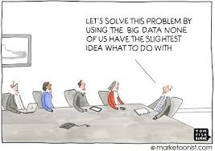
]

???
Big data....PTAGIS data base contains over 

---
class: inverse, center, middle
## What is the biggest data related issue you face as a biologist?

.pull-left[
* Collecting and Accessing
* Preserving and Protecting
* Summarizing and Analyzing
* .yellow[Timely Reporting and Publishing]
* Sharing Results
]

.pull-right[
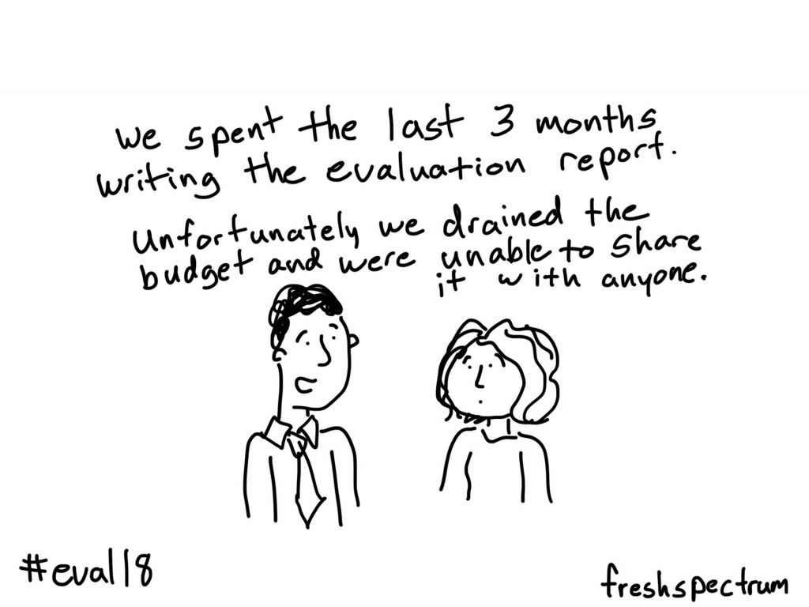
]

???
Returning back to the 80:20 problem I mentioned earlier, do you have enought time to adequatly focus on analysis and reporting?; 

---
class: inverse, center, middle
## What is the biggest data related issue you face as a biologist?

.pull-left[
* Collecting and Accessing
* Preserving and Protecting
* Summarizing and Analyzing
* Timely Reporting and Publishing
* .yellow[Sharing Results]
]

.pull-right[
    
]

???
What about getting your results noticed and used, to support informed decision making? Do the decision makers actually look at and use your reports and findings?
---
# Presentation Outline
* DFRM RME Background
  * History and Structure
  * Our (DFRM) Data Management History
  * Problems we faced
* Strategy and Vision
  * Data Flow and System
  * Recognize lots of effort in Columbia Basin currentlyh
    * don't reinvent the wheel if not necessary
* Implementation and the tools we use
  * Database / Warehouse
  * Data Management/Aggregation
  * Data Maturity Model
* R Packages
  * Data Wrangling
  * Summarize
  * Analysis - R
  * CAX Push - Python
* Data Managment Timeline and Progress
* GitHub
  
???
Use the ice breaker question as the outline!!!

The big deal is not just having the data, but being able to quickly and efficiently access needed data.
Ensure high quality results

Data Management Maturity Model

What is the Data Science Process
  
---
class: inverse

<br/>
<iframe  title="My Map" width="1800" height="550" src="figures/npt_locations.html" frameborder="2" allowfullscreen></iframe>

???

DFRM Research Division Background
M&E for Hatchery Program Evaluations
Filled M&E Gaps for Key Populations
  
---
## Problems Encountered

<div class="row">
  <div class="column">
    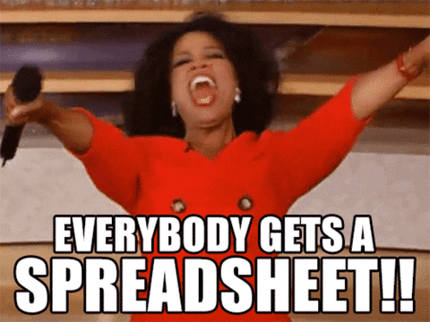
    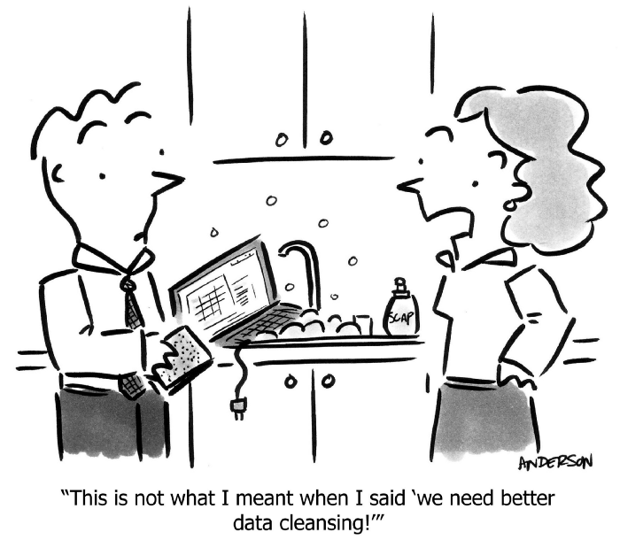
  </div>
  <div class="column">
    
    
  </div>
</div>

---
## Problems Encountered

  
---
* Early Years
  * did this work?
* Our RM&E History

---


---
# Problems we faced
* Collecting and Accessing
  - Consistency
  - Efficiencies and versioning problems
* Preserving and Protecting
  - Hard Copies
  - Outdated file formats
  - Personnel Changes
* Summarizing and Analyzing
  - Lack of expertise/training
  - Consistency
  - Reproducibility
  - Spreadsheets
* Timely Reporting and Publishing
  - Not enough time.
* Sharing Results
  - Detailed Annual Reports
---

class: inverse, left, middle
# Data Strategy and Vision

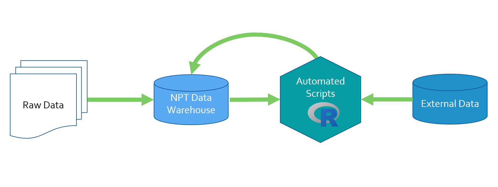

---

class: inverse, left, top
## Consistency and Standard Methods

.pull-left[
Data Collection
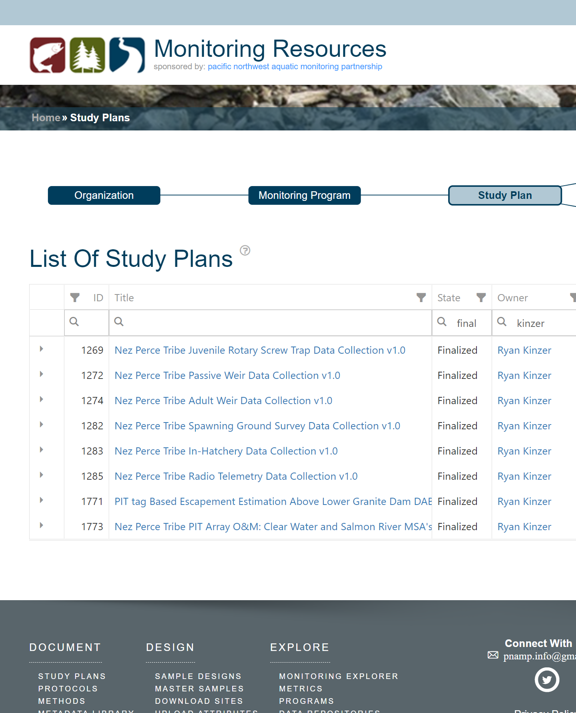
]

.pull-right[
Summaries and Analysis
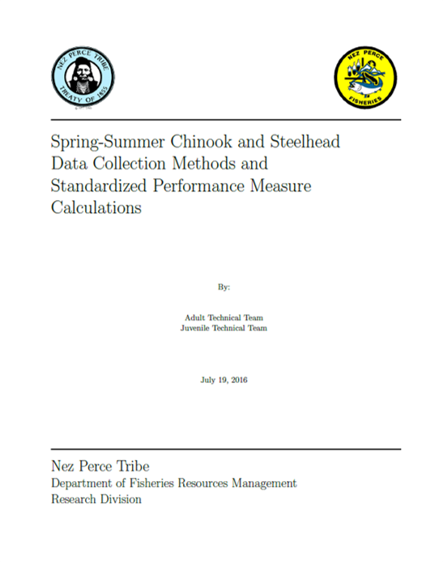
]

???
Introduce idea of tech teams?
---
class: inverse, right, middle

# Current Data Architecture

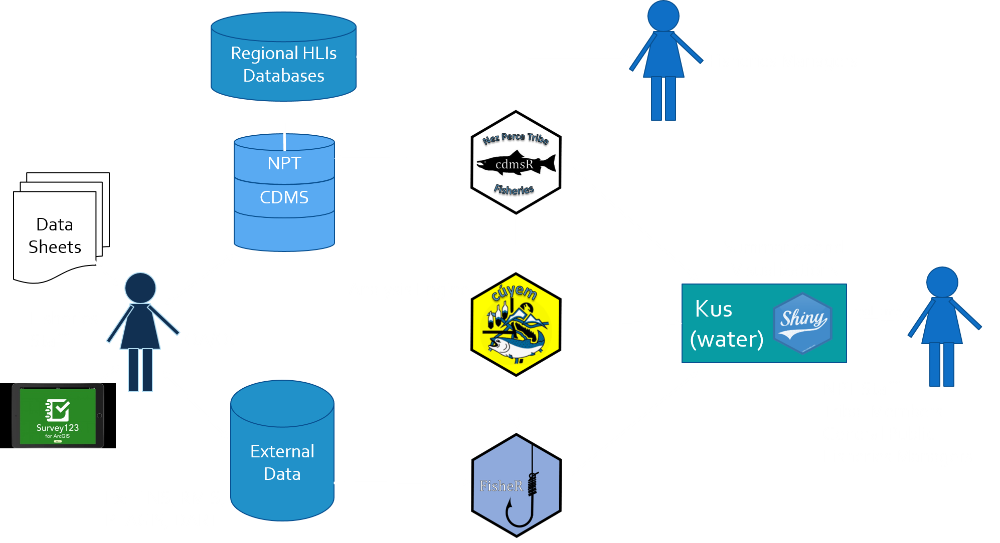
---

# Current Staffing/Product Structure

can we show tech teams and contributions?
what about monitoring strategy?

---

# Available Datasets

---

# Data Maturity Model

---

## All sounds great...but what are the problems now?

---
class: inverse, middle, center

# Examples
Sp/Sm Chinook Salmon Female Proportion <br/> 
Spring/summer Chinook Salmon Escapement <br/>
Steelhead Juvenile Survival <br/>

---

## Sp/sm Chinook Salmon Escapement - Background

.pull-left[

### Adjusted Lincoln-Petersen (Chapman 1951)
$$
\hat{N} = (\frac{(C+1)*(M+1)}{(R+1)}) - 1
$$

### Adult Weir Data
$M =$ Marks Released <br/>

### Spawning Ground Survey Data
$C =$ Total Carcasses Collected <br/>
$R =$ Recaptured Carcasses <br/>
]

.pull-right[

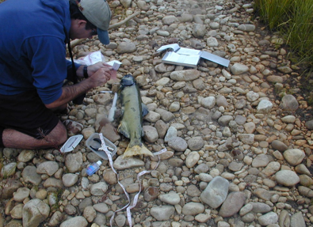
]
---
## Data Collection

.pull-left[
#### Spawning Ground Surveys

]

.pull-right[
#### Adult Weir Operations
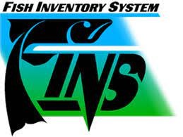
]

.center[
#### CDMS
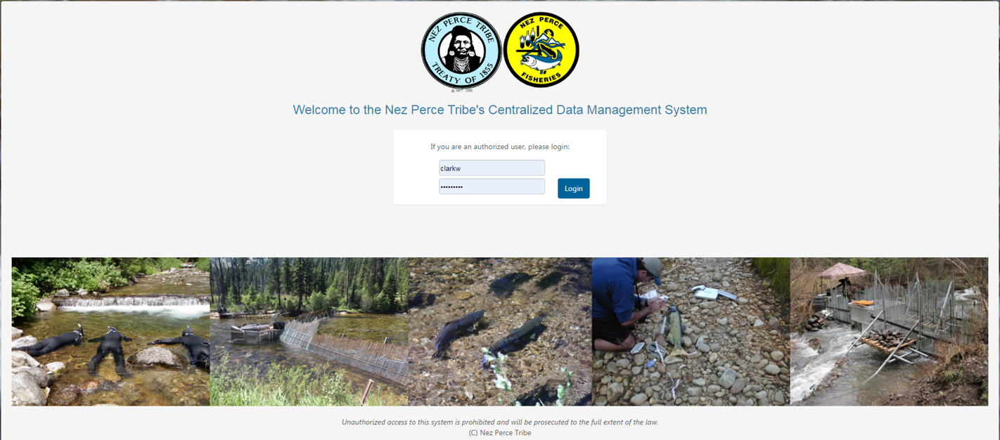
]

???
*collection is electronic but offline due to our monitoring locations
*so not exactly real-time....but close

---

## Data Access: 

```{r creds, echo = FALSE}
username <- 'api_user'
password <- 'api_user'
```

.left-code[
```{r login, echo = TRUE, message = FALSE, results = 'hide'}
library(tidyverse)
library(cdmsR)
cdmsLogin(username, password)
```

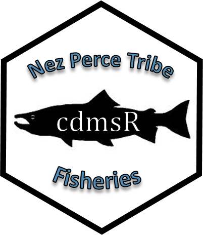
]

.right-plot[
```{r glimpse_datastores}
# Check available datasets
glimpse(getDatastores())
```
]

---

## Carcass Data Access: cdmsR

.pull-left[
```{r get_carcass2, eval = TRUE}
#car_dat <- getDatasetView(datastoreID = 79)
#save(car_dat, file = './data/car_dat.rda')
load('./data/car_dat.rda')

library(cuyem)
# Basic QA/QC and create valued-added fields
cleaned_car <- clean_carcassData(car_dat)
```
.center[

]
]

.pull-right[
```{r glimpse_car, echo = FALSE}
glimpse(cleaned_car)
```
]

---
## Weir Data Access: fisheR

.pull-left[
```{r get_trap, warning=FALSE,error=FALSE,message=FALSE}
library(fisheR)
# trap_dat <- get_FINSdata(module = 'Trapping',
#                          scope = 'NPT',
#                          startDate = '01/01/1990',
#                          endDate = '12/31/2020')
#trap_dat <- getDatasetView(datastoreID = 99)
#save(trap_dat, file = './data/trap_dat.rda')
#save(trap_dat, file = './data/trap_dat_NPT.rda')
load('./data/trap_dat.rda')
cleaned_trap <- clean_weirData(trap_dat)
```
.center[
<a href= "https://www.finsnet.org/">  </a>
  ]
]

.pull-right[
```{r glimpse_trap, echo= FALSE}
glimpse(cleaned_trap)
```
]
---
# Estimate Escapement: cuyem
```{r estMR}
MR_ests <- get_MRests(cleaned_trap, cleaned_car,
           species = 'Chinook',
           alpha = 0.05)
```

---

## Summarize Data: cuyem

```{r fem_prop}
# Estimate Female Proportion
fem_p <- cleaned_car %>%
  filter(CarcassSpecies == 'S_CHN',
         POP_NAME == 'East Fork South Fork Salmon River', #<<
         Origin != 'Unknown',
         Sex != 'Unknown') %>%
  est_group_p(.summary_var = Sex, alpha = 0.05,
              SurveyYear,
              Origin)
```
--
.tiny[

```{r tab_fem, echo = FALSE}
fem_p %>% 
  filter(Sex == 'Female') %>%
  mutate(across(.cols = where(is.numeric), .fns = round, 2)) %>%
  DT::datatable(filter = 'top')
```
]

???
Complete for the entire population and all years of record.
Normally, or in the past, our biologists would have to pull
down this data a single year at a time....pivot the spreadsheet,
build equations.....etc.  with no mistakes.

---
## Summarize Data: cuyem

.left-code[
```{r fem_pop, fig.show='hide'}
# Plot all Populations
fem_p <- cleaned_car %>%
  filter(CarcassSpecies == 'S_CHN',
         POP_NAME != 'NA', #<<
         Origin != 'Unknown',
         Sex != 'Unknown') %>%
  est_group_p(.summary_var = Sex,
              alpha = 0.05,
              POP_NAME, #<<
              SurveyYear,
              Origin) 
```

```{r fem_plot, fig.show='hide'}
# Plot
fem_p %>%
  filter(Sex == 'Female') %>%
  ggplot(aes(x = SurveyYear,
             y = p,
             colour = Origin)) +
  geom_pointrange(aes(ymin= lwr, ymax = upr),
                  position = position_dodge(width = .5))+
  facet_wrap(~POP_NAME,
             nrow = 3,
             labeller = label_wrap_gen(width = 25)) +
  theme(legend.position = 'bottom')
```
]
--

.right-plot[
```{r ref.label = 'fem_plot', echo=FALSE, fig.retina=3}
```
]

---
# Ice Breaker
What is your "go to" data analytical tools?
  * Microsoft Excel
  * R
  * Python
  * SAS
  * SPSS
---

# Summary
* First year of collaborative reporting
  - lots of time developing and getting consensus
* Second year
  - revisting methods.

---
class: inverse, middle, center

.pull-left[
## Websites and Code
need links to Github and tribes stuff,
show links so folks can write them down.
]

.pull-right[
#3 Images 
Mark Anderson 
  <a href="http://andertoons.com" class="fa fa-link"></a>
  <a href="http://twitter.com/andertoons" class="fa fa-twitter"></a> 
  <br/>
Saskia Keultjes 
  <a href="http://saskdraws.com" class="fa fa-link"></a>
  <a href="http://twitter.com/saskiakeultjes" class="fa fa-twitter"></a>
  <br/>
Chris Lysy
  <a href="http://freshspectrum.com" class="fa fa-link"></a>
  <a href="http://twitter.com/clysy" class="fa fa-twitter"></a>
  <br/>
Timo Elliot
  <a href="https://timoelliott.com" class="fa fa-link"></a>
  <a href="http://twitter.com/timoelliott" class="fa fa-twitter"></a>
  <br/>
Tom Fishburne
  <a href="https://marketoonist.com" class="fa fa-link"></a>
  <a href="http://twitter.com/marketoonist" class="fa fa-twitter"></a>
  <br/>
]

???
Mark Anderson - paid
Saskia - no contact
Chris - yes
Timo - yes
Tom - paid
