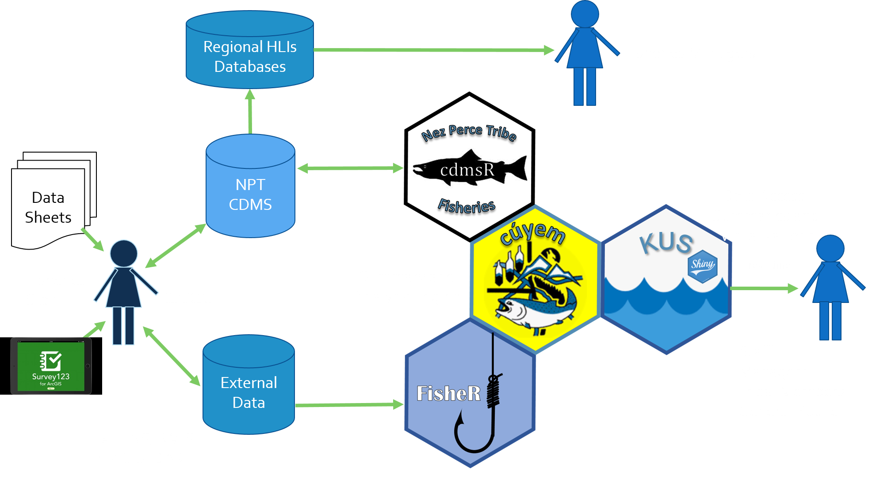
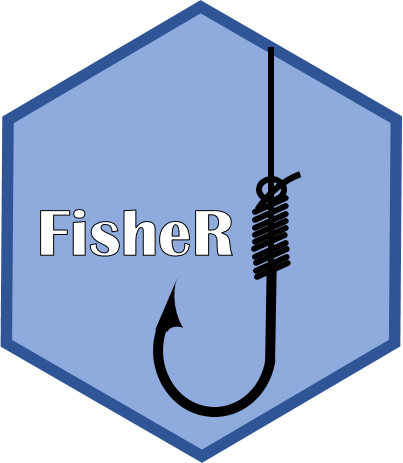

```{r map_iptds, eval = FALSE, echo = FALSE, warning=FALSE, message=FALSE, fig.width = 7}
library(tidyverse)
library(leaflet)
library(htmlwidgets)
library(htmltools)

library(cdmsR)
cdmsLogin('apikey', 'apikey')

# load points, rivers and polygons
load("../../DFRM Projects/River_Mapping/data/points/site_config.rda")
load("../../DFRM Projects/River_Mapping/data/points/cdms_locations.rda")
load("../../DFRM Projects/River_Mapping/data/flowlines/large_rivers.rda")
load("../../DFRM Projects/River_Mapping/data/polygons/SR_pops.rda")
load("../../DFRM Projects/River_Mapping/data/polygons/npt_boundaries.rda")

locs <- locs %>%
  mutate(LocationType = ifelse(grepl('IPTDS',LocationType), 'In-stream PIT Array', LocationType),
        LocationType = ifelse(grepl('FCRR',LocationType), 'Fall Chinook Run-Reconstruction', LocationType)) %>%
  filter(LocationType != 'DM Issues')

#load("../../DFRM Projects/River_Mapping/data/flowlines/SR_streams.rda")
snake_rivers <- sf::st_transform(snake_rivers, crs = 4326)
pnw_rivers <- sf::st_transform(pnw_rivers, crs = 4326)

# NPT areas

l <- leaflet() %>%
  #addTiles() %>%
  setView(lng = -118.50,
          lat = 45.4000,#44.9218,
          zoom = 6) %>%
  addProviderTiles(providers$Esri.WorldTopoMap)%>%
  addPolylines(data = pnw_rivers, color = 'blue', weight = 1) %>%
  addPolylines(data = snake_rivers, color = 'blue', weight = 1)

co_type <- colorFactor('Paired', locs$LocationType)

tag.map.title <- tags$style(HTML("
  .leaflet-control.map-title { 
    transform: translate(-50%,20%);
    position: fixed !important;
    left: 50%;
    text-align: center;
    padding-left: 10px; 
    padding-right: 10px; 
    background: rgba(255,255,255,0.75);
    font-weight: bold;
    font-size: 16px;
  }
"))

map_title <- tags$div(
  tag.map.title, HTML("NPT Fish Monitoring in the Snake River Basin")
)

npt_locs <- l %>%
  addPolygons(data = sth_pop,
              stroke = TRUE,
              color = 'black',
              weight = 1,
              opacity = 1,
              fillColor = 'grey',
              fillOpacity = .5,
              group = 'Snake Basin') %>%
  addPolylines(data = icc,
              stroke = TRUE,
              color = 'blue',
              fill = NA,
              group = 'Indian Claims Commission') %>%
  # addPolygons(data = npt1863,
  #             stroke = TRUE,
  #             color = 'blue',
  #             fill = NA,
  #             group = 'Treaty 1863') %>%
  addCircles(lat = locs$Latitude, lng = locs$Longitude, group = 'Monitoring Locations', color = co_type(locs$LocationType), radius = 100,
           popup = paste("<b>Location Label:</b>", locs$Label, "<br>"),
           popupOptions = popupOptions(noHide = T, textsize = "15px"),
           highlightOptions = highlightOptions(color = "white",
                                               weight = 5, bringToFront = F, opacity = 1)) %>%
  #addControl(map_title, position = 'topleft', className = "map-title") %>%
  addLegend(position = 'bottomleft',
            title = 'Monitoring Locations', pal = co_type,
            values = unique(locs$LocationType)) %>%
  addLegend(position = "bottomleft",
            title = 'Boundaries', colors = c('grey', 'blue'),#, 'blue'),
            labels = c("Snake Basin", "Indian Claims Commission"), #, "Treaty 1863"),
            group = c("Snake Basin", "Indian Claims Commission"), #, "Treaty 1863"),
            opacity = 1) %>%
  addLayersControl(
    overlayGroups = c("Snake Basin", "Indian Claims Commission", "Monitoring Locations"),# "Treaty 1863"),
    options = layersControlOptions(collapsed = FALSE)
  )

#npt_locs

path <- file.path(getwd(), "figures", "npt_locations.html")
saveWidget(npt_locs, file = path)

```

class: title-slide

<div id="titlebox">
  <hr style="height:2px;border-width:0;color:#000063;background-color:#000063">
  <hr style="height:2px;border-width:0;color:#000063;background-color:#000063">
  <p>.bold[Streamlined data flow for improved decision making:]</p>
</div>

<div id="authorbox">

<link rel="stylesheet" href="https://cdnjs.cloudflare.com/ajax/libs/font-awesome/4.7.0/css/font-awesome.min.css">

  Ryan N. Kinzer
    <a href="mailto: ryank@nezperce.org" class="fa fa-paper-plane"></a>
    <a href="http://github.com/ryankinzer" class="fa fa-github"></a>
    <a href="http://twitter.com/kinzer_ryan" class="fa fa-twitter"></a>
  <br/>
  Nez Perce Tribe <br/>
  Department of Fisheries Resources Management <br/>
  Research Division <a href="https://nptfisheries.shinyapps.io/kus-data/" class="fa fa-link"></a>
  <br/>
</div>  

???
Thank you for joining us today.  I'm sure you are hear to see Dan's talk and were just unlucky to show up early.  

---
class: middle
background-image: url("figures/wang.gif")
background-position: top 50% right 55px
background-size: 40%

.pull-left[
...from data collection to reporting and all the gunk in between.
<!--<p style="font-size:25px">...from data collection to reporting and all the gunk in between.</p>-->
]

???

focusing on the flow of data. when you have it.

---
class: mainslide
layout: true
---
class: center, middle

background-color: black
background-image: url("figures/problem.png")
background-position: top 0px left 0px
background-size: 100%


.white[

"Bad data for half the price of good data is a fool's investment." - Clark and Whitfield 1993

"science is presently hindered by the '80:20 problem'...." – Michener 2012

"More often than scientists would like to admit, they cannot even recover the data associated with their own published works." – Goodman et al. 2014

"This fundamental shift in thinking from 'I own the data' to 'I collect and share the data' .... is essential to the transparency and reproducibility of the open science framework." – Hampton et al. 2015
]

???
These four quotes really resonated with me when I read them for the first time a few years ago, and how they pertained to my experiences working with various fish biologists over the years.  I won't read them exactly, but they will give you the reasons I'm moving forward in the way that I am, and that we will discuss today.

---
background-image: url('figures/NPTlogos2.png')
background-position: top 5% right 5%
background-size: 10%

# Goals for Today
* Highlight a few data management and analysis problems that we have faced.
* Illustrate one way to tackle the issues.
* Get you thinking about your data flow and ways to improve.

.center[

]

???

---
class: inverse, middle, center

## Generate discussion and learn from each other.

???

And then selfishly, I want to generate discussion, learn from each other, and hopefully I discover from all of you how I can do things better. 

---
class: inverse, center, middle

## MentiMeter Poll
### Which piece of the data flow process is the most problematic for you?

.pull-left[
* .yellow[Querying and Accessing]
* Preserving and Protecting
* Summarizing and Analyzing
* Timely Reporting
* Sharing and Publishing Results
]

.pull-right[
    
]

???
* Columbia River basin and PIT-tag data, or CWT data stored in the RMIS database, genetics data--often requires intimate knowledge of data repository and queries to get the right information you are looking for.

---
class: inverse, center, middle

## MentiMeter Poll
### Which piece of the data flow process is the most problematic for you?

.pull-left[
* Querying and Accessing
* .yellow[Preserving and Protecting]
* Summarizing and Analyzing
* Timely Reporting
* Sharing and Publishing Results
]

.pull-right[
    
]

???
* In 2020, Bonneville Power Administration spent over 100 million on RME, and over half of that was spent on data collection.
---
class: inverse, center, middle

## MentiMeter Poll
### Which piece of the data flow process is the most problematic for you?

.pull-left[
* Querying and Accessing
* Preserving and Protecting
* .yellow[Summarizing and Analyzing]
* Timely Reporting
* Sharing and Publishing Results
]

.pull-right[
    
]

???
Big data....PTAGIS data base contains over 

---
class: inverse, center, middle

## MentiMeter Poll
### Which piece of the data flow process is the most problematic for you?

.pull-left[
* Querying and Accessing
* Preserving and Protecting
* Summarizing and Analyzing
* .yellow[Timely Reporting]
* Sharing and Publishing Results
]

.pull-right[

]

???
Returning back to the 80:20 problem I mentioned earlier, do you have enought time to adequatly focus on analysis and reporting?; 

---
class: inverse, center, middle

## MentiMeter Poll
### Which piece of the data flow process is the most problematic for you?

.pull-left[
* Querying and Accessing
* Preserving and Protecting
* Summarizing and Analyzing
* Timely Reporting
* .yellow[Sharing and Publishing Results]
]

.pull-right[
    
]

<a href="https://www.menti.com/eirgddtvad">https://www.menti.com/eirgddtvad</a>

???
What about getting your results noticed and used, to support informed decision making? Do the decision makers actually look at and use your reports and findings?

---

<div style='position: relative; padding-bottom: 56.25%; padding-top: 35px; height: 0; overflow: hidden;'><iframe sandbox='allow-scripts allow-same-origin allow-presentation' allowfullscreen='true' allowtransparency='true' frameborder='0' height='315' src='https://www.mentimeter.com/embed/c1b1cea343c68eaa661412bde8e8cedf/b0e1bf101754' style='position: absolute; top: 0; left: 0; width: 100%; height: 100%;' width='420'></iframe></div>

---
background-image: url('figures/NPTlogos2.png')
background-position: top 5% right 5%
background-size: 10%

# Presentation Outline
* DFRM Research Division and RME Background
* Data Management and Analysis Problems
* Data Strategy and Vision
* Example: Natural-origin Spawner Abundance

.center[

]

???

The big deal is not just having the data, but being able to quickly and efficiently access needed data.
Ensure high quality results

Data Management Maturity Model

What is the Data Science Process
  
---
class: middle
background-image: url('figures/NPTlogos2.png')
background-position: top 5% right 5%
background-size: 10%

### DFRM RME Background

.left-column[
**Four Office Locations**
* Sweetwater
* Orofino
* McCall
* Joseph

**Nine RME Projects**
* Hatchery Program Evaluations
* Status and Trends Monitoring

**Independently Focused**
]

.right-column[
<iframe  title="My Map" width="1800" height="500" src="figures/npt_locations.html" frameborder="2" allowfullscreen></iframe>
]

???

Work almost exclusively in the Snake River Basin.

DFRM Research Division Background
M&E for Hatchery Program Evaluations
Filled M&E Gaps for Key Populations

  * Office: Sweetwater, Orofino, Joseph, McCall

  * Hatchery Program Evaluations
    NPTH Fall
    NPTH Spring
    SRBA
    JCAPE
    GRSME
  * Status and Trends Monitoring
    IPTDS
    ISAM
    Bulltrout
  * Data Management

---
class: inverse, middle, center
# Problems

---
class: middle
background-image: url("figures/spreadsheet.gif")
background-position: top 50% left 50%
background-size: 50%

???
# Problems we faced
* Collecting and Accessing
  - Consistency
  - Efficiencies and versioning problems
* Preserving and Protecting
  - Hard Copies
  - Outdated file formats
  - Personnel Changes
* Summarizing and Analyzing
  - Lack of expertise/training
  - Consistency
  - Reproducibility
  - Spreadsheets
* Timely Reporting and Publishing
  - Not enough time.
* Sharing Results
  - Detailed Annual Reports

---
class: middle
background-image: url("figures/Apple-Orange.jpg")
background-position: top 50% left 50%
background-size: 100%

???
Coordinated Assessments - Regional Databases
How is this data being rolled up across the landscape and being used to inform decisions?
We saw this as a potential problem, and if we were facing it withing our own division, it would only get larger as you went across agencies and basins.

---
class: middle
background-image: url("figures/drives.png")
background-position: top 50% left 50%
background-size: 75%

---
class: middle
background-image: url("figures/crossed-fingers.png")
background-position: top 50% left 50%
background-size: 75%
---
class: inverse, middle, center

# What did we do?

---
class: inverse, left, middle
# Data Strategy and Vision


???
Dreamt up a simple solution based on these four boxes.

---

class: inverse, left, top
## Consistency and Standard Methods

.pull-left[
Data Collection

]

.pull-right[
Summaries and Analysis

]

???
Introduce idea of tech teams
---
class: inverse, right, middle

# Current Data Architecture



???

Stacy Schumacher (CTUIR) Feb. 11th will focus on CDMS- so I encourage you to watch Stacy's talk if you are interested in the details of the database and how it functions. 

# Current Staffing/Product Structure

can we show tech teams and contributions?
what about monitoring strategy?

# Available Datasetsp

# Data Maturity Model


## All sounds great...but what are the problems now?

---
class: inverse, middle, center

# Example

???
Sp/Sm Chinook Salmon Female Proportion <br/> 
Spring/summer Chinook Salmon Escapement <br/>
Steelhead Juvenile Survival <br/>

---
class: center, middle

### Sp/sm Chinook Salmon - Natural-origin Spawner Abundance

$$\hat{NOSA} = \hat{N}*(1-\hat{pHOS})*(1-\hat{pPSM}_{N})$$

.pull-left[

.bold[Above Weir Escapement]
$$\hat{N} = (\frac{(n_1+1)*(n_2+1)}{(m_2+1)}) - 1$$
.bold[Proportion of Hatchery Origin Spawners]
$$\hat{pHOS} = \frac{n_H}{(n_H + n_N)}$$

.bold[Pre-spawn Mortality]
$$\hat{pPSM}_{N} = \frac{n_{p,N}}{(n_{p,N} + n_{s,N})}$$

]

.pull-right[


]

???
#### Adult Weir Data
$n_1 =$ Marks Released <br/>

#### Spawning Ground Survey Data
$n_2 =$ Total Carcasses Collected <br/>
$m_2 =$ Recaptured Carcasses <br/>
$n_H =$  Hatchery-origin Carcasses<br/>
$n_N =$  Natural-origin Carcasses<br/>
$n_{p} =$  Pre-spawned Carcasses<br/>
$n_{s} =$  Spawned Carcasses<br/>

---

## Data Collection

.pull-left[
.center[
#### Spawning Ground Surveys

]
]

.pull-right[
.center[
#### Adult Weir Operations

]
]

.center[
#### Centralized Data Management System

]

???
*collection is electronic but offline due to our monitoring locations
*so not exactly real-time....but close

ETIS - Samantha Smith: Jan. 7th, 2021, Latest applications for handheld devices for field data collection 

---

## Data Access

```{r creds, echo = FALSE}
username <- 'api_user'
password <- 'api_user'
```

.pull-left[
<br/>

```{r login, echo = TRUE, message = FALSE, results = 'hide'}
library(tidyverse)
library(cdmsR)
cdmsLogin(username, password)
```

```{r glimpse_datastores, eval=FALSE}
# Check for available datasets
glimpse(getDatastores())
```
]

.pull-right[
.center[

]
]

.scroll-x[
```{r glimpse_out, ref.label = "glimpse_datastores", echo = FALSE}
```
]

---

## Data Access

.pull-left[
```{r get_carcass2, eval = TRUE, cache=TRUE, cache.extra = file.mtime('./data/car_dat.rda')}
#car_dat <- getDatasetView(datastoreID = 79)
#save(car_dat, file = './data/car_dat.rda')
load('./data/car_dat.rda')
```

```{r load_cuyem}
library(cuyem)
# Basic QA/QC and create valued-added fields
cleaned_car <- clean_carcassData(car_dat)
```

.center[

]
]

.pull-right[
.scroll-box-24[
```{r glimpse_car, echo = FALSE}
glimpse(cleaned_car)
```
]
]

---
## Weir Data Access: fisheR

.pull-left[

```{r load_fisheR}
library(fisheR)
```

```{r get_trap, cache=TRUE, cache.extra = file.mtime('./data/trap_dat_NPT.rda')}
# trap_dat <- get_FINSdata(
#   module = 'Trapping',
#   scope = 'NPT',
#   startDate = '01/01/1990',
#   endDate = '12/31/2020'
# )

#save(trap_dat, file = './data/trap_dat.rda')
load('./data/trap_dat.rda')
cleaned_trap <- clean_weirData(trap_dat)
```

.center[


  ]
]

.pull-right[
.scroll-box-24[
```{r glimpse_trap, echo= FALSE}
glimpse(cleaned_trap)
```
]
]

---
background-image: url('figures/dfrm_hex.png')
background-position: top 5% right 5%
background-size: 10%

# Estimate Escapement
```{r estMR}
MR_ests <- get_MRests(
  cleaned_trap, cleaned_car,
  species = 'Chinook',
  alpha = 0.05)
```

.tiny[
```{r glimpse_mr, echo = FALSE}
MR_ests %>% 
  mutate(across(.cols = where(is.numeric), .fns = round, 2)
  ) %>%
  DT::datatable(filter = 'top',
                options = list(pageLength = 8)
  )
```
]

---
# Proportion of Hatchery Spawners

.left-code[
```{r est_pHOS}
pHOS <- cleaned_car %>%
  filter(
    CarcassSpecies == 'S_CHN',
    Origin %in% c('Natural', 'Hatchery'),
    AboveWeir == 'Yes'
  ) %>%
  est_group_p(
    .summary_var = Origin,
    alpha = 0.05,
    SurveyYear,
    StreamName
  ) %>%
  rename_with(~paste0('pHOS_',.x), n:upr)
```

```{r est_pHOS_fig, fig.show = 'hide', echo = FALSE}
pHOS %>%
  filter(StreamName == 'Johnson Creek') %>%
  filter(Origin == 'Hatchery') %>%
  ggplot(aes(x = SurveyYear, y = pHOS_p)) +
  geom_pointrange(aes(ymin = pHOS_lwr,
                      ymax = pHOS_upr)) +
  facet_wrap(~StreamName) +
  labs(x = 'Survey Year',
       y = 'pHOS') +
  theme_bw()
```
.center[

  ]
]

.right-plot[
```{r fig_pHOS, ref.label='est_pHOS_fig', fig.retina = 3, echo = FALSE}
```
]

---
# Proportion Pre-spawn Mortality

.left-code[
```{r est_pPSM}
pPSM <- cleaned_car %>%
  filter(
    CarcassSpecies == 'S_CHN',
    Origin  == 'Natural',
    SpawnedOut %in% c('Yes', 'No'),
    AboveWeir == 'Yes'
  ) %>%
  est_group_p(
    .summary_var = SpawnedOut,
    alpha = 0.05,
    SurveyYear,
    StreamName
  ) %>%
  rename_with(~paste0('pPSM_',.x), n:upr)
```

```{r est_pPSM_fig, fig.show='hide', echo = FALSE}
pPSM %>%
  filter(StreamName == 'Johnson Creek') %>%
  filter(SpawnedOut == 'No') %>%
  ggplot(aes(x = SurveyYear, y = pPSM_p)) +
  geom_pointrange(aes(ymin = pPSM_lwr,
                      ymax = pPSM_upr)) +
  facet_wrap(~StreamName) +
  labs(x = 'Survey Year',
       y = 'pPSM') +
  theme_bw()
```

.center[

  ]

]

.right-plot[
```{r fig_psm, ref.label='est_pPSM_fig', fig.retina=3, echo = FALSE}
```
]

---

# Natural-origin Spawner Abundance

.left-code[
```{r est_NOSA}
NOSA <- left_join(
  MR_ests %>% rename(SurveyYear = trap_year, StreamName = stream),
  pHOS %>%
    filter(Origin == 'Hatchery'),
  by = c("SurveyYear", "StreamName")
) %>%
  left_join(
    pPSM %>%
      filter(SpawnedOut == 'No'),
    by = c("SurveyYear", "StreamName")
  ) %>%
  mutate(
    NOSA = N * (1-pHOS_p) * (1-pPSM_p)
  )
```

```{r est_NOSA_fig, fig.show = 'hide', echo = FALSE}
NOSA %>%
  filter(StreamName == 'Johnson Creek') %>%
  ggplot(aes(x = SurveyYear, y = NOSA)) +
  geom_line() +
  facet_wrap(~StreamName) +
  labs(x = 'Survey Year',
       y = 'NOSA') +
  theme_bw()
```

.center[

  ]

]

.right-plot[
```{r fig_nosa, ref.label='est_NOSA_fig', fig.retina=3, echo=FALSE}
```
]

---

# Natural-origin Spawner Abundance

.left-code[

```{r get_redd}
#redd_dat <- getDatasetView(datastoreID = 78)
#save(redd_dat, file = './data/redd_dat.rda')
load('./data/redd_dat.rda')
cleaned_redd <- clean_reddData(redd_dat)
```

```{r weir_disp, echo=FALSE}

weir_disp <- cleaned_trap %>%
  #filter(trap_year == 2001) %>%
  #filter(stream == 'Johnson Creek') %>%
  mutate(origin = ifelse(grepl('Hatchery', origin), 'Hatchery', origin),
         #disposition = ifelse(disposition == 'Transferred', 'Ponded', disposition),
         purpose = ifelse(grepl('FINS', purpose), 'Brood Stock', purpose)) %>%
  filter(target_species == species) %>%
  filter(!recap) %>%
  cnt_groups(.summary_var = disposition, trap_year, stream, species) %>%
  pivot_wider(names_from = disposition, values_from = n, values_fill = list(n = 0)) %>%
  left_join(cleaned_trap %>%
   filter(!(stream == 'Johnson Creek' & grepl('FINS', purpose))) %>%
   #filter(trap_year == 2001) %>%
   #filter(stream == 'Johnson Creek') %>%
               filter(target_species == species) %>%
               filter(grepl('Natural|Hatchery', origin)) %>%
               filter(grepl('FINS|Brood Stock', purpose)) %>%
               mutate(origin = case_when(origin == 'Natural' ~ 'NOBroodStockRemoved',
                                         grepl('Hatchery', origin) ~ 'HOBroodStockRemoved')) %>%
               cnt_groups(.summary_var = origin, trap_year, stream, species) %>%
               pivot_wider(names_from = origin, values_from = n),
             by = c('trap_year', 'stream', 'species')
  )

MR_ests <- left_join(weir_disp, MR_ests, by = c('trap_year', 'stream', 'species'))
```


```{r get_NOSA, warning=FALSE, message=FALSE}
NOSA_ests <- get_NOSAests(cleaned_redd,
                          cleaned_car,
                          MR_ests
                          )
```

```{r NOSA_fig_2, fig.show = 'hide', echo = FALSE}
NOSA_ests %>%
  filter(POP_NAME %in% c('East Fork South Fork Salmon River',
                         'Secesh River',
                         'Lolo Creek')) %>%
  mutate(NOSAij_lwr = ifelse(NOSAij_lwr < 0, 0, NOSAij_lwr)) %>%
  ggplot(aes(x = SurveyYear, y = NOSAij)) +
  geom_ribbon(aes(ymin = NOSAij_lwr, ymax = NOSAij_upr), alpha = .5, colour = 'grey') +
  geom_line() +
  scale_y_continuous(limits = c(0,1200), expand = c(0,0)) +
  facet_wrap(~POP_NAME, nrow = 2) +
  labs(x = 'Survey Year',
       y = 'NOSAij') +
  theme_bw()
```

.center[

  ]

]

.right-plot[
```{r plot_NOSA_2, ref.label='NOSA_fig_2', fig.retina=3, echo = FALSE}
```
]


???
Complete for the entire population and all years of record.
Normally, or in the past, our biologists would have to pull
down this data a single year at a time....pivot the spreadsheet,
build equations.....etc.  with no mistakes.

---
class: inverse, bottom, left
background-image: url('figures/dfrm_suite_hex.png')
background-position: top 5% right 5%
background-size: 50%

## Data Visualizaton and Reporting

---

class: inverse, bottom, left
background-image: url('figures/kus_hex.png')
background-position: top 5% right 5%
background-size: 15%

## Data Visualizaton and Reporting

.center[
<a href="http://kus.nptfisheries.org/kus-data/">

</a>
]

---
class: inverse, center, middle

## MentiMeter Poll
### Which part of your research project takes the most time to complete?

  * **Project Administration and Process** (e.g., planning, personnel, metadata documentation)
  * **Budgeting and Contracting** (e.g., inventories, budget tracking, quarterly reports)
  * **Data Management** (e.g., QA/QC, querying, summarizing)
  * **Data Analysis and Hypothesis Testing** (e.g., defining and answering research questions)
  * **Sharing Information and Publishing** (e.g., peer-reviewed, presentations, adaptive management)
  
.center[
  
]
  
---
# In Closing

.pull-left[
* Data Management is a work in progress
* 2020 - 1st year of implementation
  _ Collaborative Project Reports
  - Focused on development
  - Required compromises and concessions
* Currently - 2021
  - Reviewing and documenting methods
  - Identifying missing parts
  - Improving work flow
]

.pull-right[
.center[
  
]
]

---
class: inverse, bottom, left
background-image: url('figures/tidy_dfrm_suite.png')
background-position: top 5% right 5%
background-size: 70%

# Credits

.pull-left[
## Website

<a href="http://kus.nptfisheries.org/kus-data"></a> </br>
<a href="http://kus.nptfisheries.org/kus-data">http://kus.nptfisheries.org/kus-data</a>

## Code

<a href="http://github.com/ryankinzer/cdmsR"></a>
<a href="http://github.com/ryankinzer/cuyem"></a>
<a href="http://github.com/ryankinzer/fisheR"></a>
<a href="http://github.com/ryankinzer/kus"></a> </br>

<a href="http://github.com/ryankinzer/" class="fa fa-github"> &nbsp; http://github.com/ryankinzer/</a>
]

.pull-right[

</br>
</br>
</br>
</br>
</br>
</br>
</br>
</br>

.bottom[
## Cartoons

Timo Elliot
  <a href="http://twitter.com/timoelliott" class="fa fa-twitter"></a>
  <a href="https://timoelliott.com" class="fa fa-link">https://timoelliott.com</a>
  <br/>
  
Chris Lysy
  <a href="http://twitter.com/clysy" class="fa fa-twitter"></a>
  <a href="http://freshspectrum.com" class="fa fa-link">http://freshspectrum.com</a>
  <br/>
]
]

???
Chris - yes
Timo - yes
