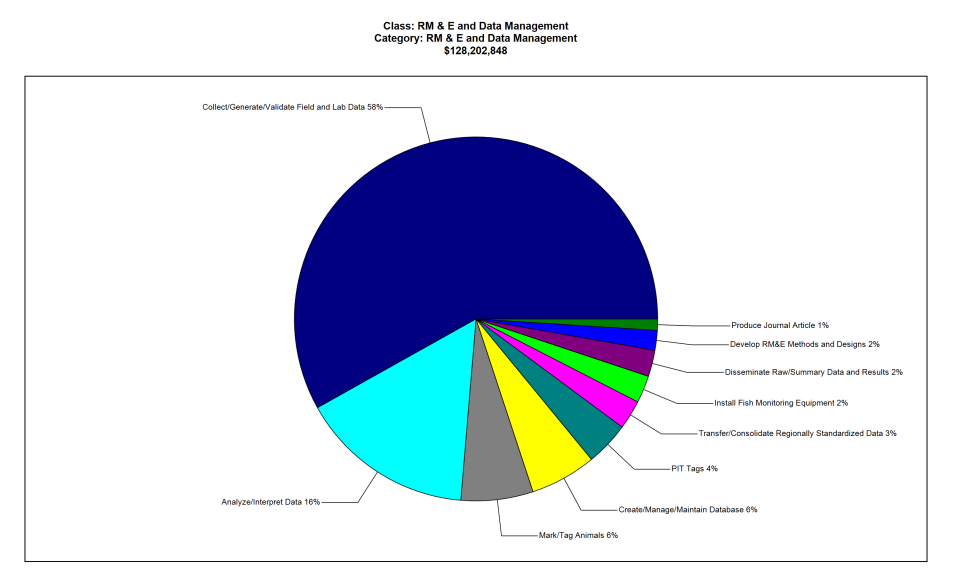
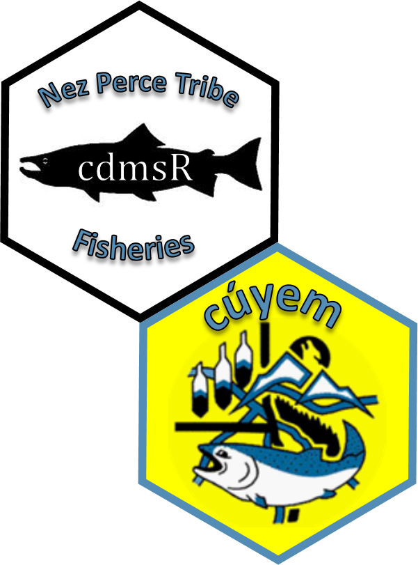

```{r map_iptds, eval = FALSE, echo = FALSE, warning=FALSE, message=FALSE, fig.width = 7}
library(tidyverse)
library(leaflet)
library(htmlwidgets)
library(htmltools)

library(cdmsR)
cdmsLogin('apikey', 'apikey')

# load points, rivers and polygons
load("../../DFRM Projects/River_Mapping/data/points/site_config.rda")
load("../../DFRM Projects/River_Mapping/data/points/cdms_locations.rda")
load("../../DFRM Projects/River_Mapping/data/flowlines/large_rivers.rda")
load("../../DFRM Projects/River_Mapping/data/polygons/SR_pops.rda")
load("../../DFRM Projects/River_Mapping/data/polygons/npt_boundaries.rda")

locs <- locs %>%
  mutate(LocationType = ifelse(grepl('IPTDS',LocationType), 'In-stream PIT Array', LocationType),
        LocationType = ifelse(grepl('FCRR',LocationType), 'Fall Chinook Run-Reconstruction', LocationType)) %>%
  filter(LocationType != 'DM Issues')

#load("../../DFRM Projects/River_Mapping/data/flowlines/SR_streams.rda")
snake_rivers <- sf::st_transform(snake_rivers, crs = 4326)
pnw_rivers <- sf::st_transform(pnw_rivers, crs = 4326)

# NPT areas

l <- leaflet() %>%
  #addTiles() %>%
  setView(lng = -118.50,
          lat = 45.4000,#44.9218,
          zoom = 6) %>%
  addProviderTiles(providers$Esri.WorldTopoMap)%>%
  addPolylines(data = pnw_rivers, color = 'blue', weight = 1) %>%
  addPolylines(data = snake_rivers, color = 'blue', weight = 1)

co_type <- colorFactor('Paired', locs$LocationType)

tag.map.title <- tags$style(HTML("
  .leaflet-control.map-title { 
    transform: translate(-50%,20%);
    position: fixed !important;
    left: 50%;
    text-align: center;
    padding-left: 10px; 
    padding-right: 10px; 
    background: rgba(255,255,255,0.75);
    font-weight: bold;
    font-size: 16px;
  }
"))

map_title <- tags$div(
  tag.map.title, HTML("NPT Fish Monitoring in the Snake River Basin")
)

npt_locs <- l %>%
  addPolygons(data = sth_pop,
              stroke = TRUE,
              color = 'black',
              weight = 1,
              opacity = 1,
              fillColor = 'grey',
              fillOpacity = .5,
              group = 'Snake Basin') %>%
  addPolylines(data = icc,
              stroke = TRUE,
              color = 'blue',
              fill = NA,
              group = 'Indian Claims Commission') %>%
  # addPolygons(data = npt1863,
  #             stroke = TRUE,
  #             color = 'blue',
  #             fill = NA,
  #             group = 'Treaty 1863') %>%
  addCircles(lat = locs$Latitude, lng = locs$Longitude, group = 'Monitoring Locations', color = co_type(locs$LocationType), radius = 100,
           popup = paste("<b>Location Label:</b>", locs$Label, "<br>"),
           popupOptions = popupOptions(noHide = T, textsize = "15px"),
           highlightOptions = highlightOptions(color = "white",
                                               weight = 5, bringToFront = F, opacity = 1)) %>%
  #addControl(map_title, position = 'topleft', className = "map-title") %>%
  addLegend(position = 'bottomleft',
            title = 'Monitoring Locations', pal = co_type,
            values = unique(locs$LocationType)) %>%
  addLegend(position = "bottomleft",
            title = 'Boundaries', colors = c('grey', 'blue'),#, 'blue'),
            labels = c("Snake Basin", "Indian Claims Commission"), #, "Treaty 1863"),
            group = c("Snake Basin", "Indian Claims Commission"), #, "Treaty 1863"),
            opacity = 1) %>%
  addLayersControl(
    overlayGroups = c("Snake Basin", "Indian Claims Commission", "Monitoring Locations"),# "Treaty 1863"),
    options = layersControlOptions(collapsed = FALSE)
  )

#npt_locs

path <- file.path(getwd(), "figures", "npt_locations.html")
saveWidget(npt_locs, file = path)

```

class: title-slide

<div id="titlebox">
  <hr style="height:2px;border-width:0;color:#000063;background-color:#000063">
  <hr style="height:2px;border-width:0;color:#000063;background-color:#000063">
  <p>.bold[Streamlined data flow for improved decision making:]</p>
</div>

<div id="authorbox">

<link rel="stylesheet" href="https://cdnjs.cloudflare.com/ajax/libs/font-awesome/4.7.0/css/font-awesome.min.css">

  Ryan N. Kinzer
    <a href="mailto: ryank@nezperce.org" class="fa fa-paper-plane"></a>
    <a href="http://github.com/ryankinzer" class="fa fa-github"></a>
    <a href="http://twitter.com/kinzer_ryan" class="fa fa-twitter"></a>
  <br/>
  Nez Perce Tribe <br/>
  Department of Fisheries Resources Management <br/>
  Research Division <a href="https://nptfisheries.shinyapps.io/kus-data/" class="fa fa-link"></a>
  <br/>
</div>  

???
Thank you for joining us today. And I'm under no delusion that you all showed up to hear my talk, I know you are here to listen to Dan, and were just unlucky and showed up early. But now that you are here, maybe you will find some of my topics interesting.  So as Russel stated, I will be talking about streamlining the data flow process,

---
class: middle
background-image: url("figures/wang.gif")
background-position: top 50% right 55px
background-size: 40%

.pull-left[
...from data collection to reporting and all the gunk in between.
<!--<p style="font-size:25px">...from data collection to reporting and all the gunk in between.</p>-->
]

???

and focusing on the areas between data collection to reporting, or in other words, when you have the data.

---
class: mainslide
layout: true
---
class: center, middle

background-color: black
background-image: url("figures/problem.png")
background-position: top 0px left 0px
background-size: 100%


.white[

"Bad data for half the price of good data is a fool's investment." - Clark and Whitfield 1993

"Science is presently hindered by the '80:20 problem'...." – Michener 2012

"More often than scientists would like to admit, they cannot even recover the data associated with their own published works." – Goodman et al. 2014

"This fundamental shift in thinking from 'I own the data' to 'I collect and share the data' .... is essential to the transparency and reproducibility of the open science framework." – Hampton et al. 2015
]

???
These four quotes really set the stage, and what I would like you to think about for the rest of the talk, and why the staff within the Research Division of the Nez Perce Tribe's Department of Fisheries has started to develop and implement a data management strategy that tracks data through the process.  So I will touch on them briefly; 

I'm sure we can all agree on the first one, bad data is a fool's investment. Science is hindered by the 80:20 problem, which basically means we spend 80% of our time completing the less influential tasks, and only 20% of our time working towards our main objectives. And from what I have observed in my career as a fisheries biologist, is that generally we spend the majority of their time organizing, QA/QC, and managing data, and only 20% of their time investigating patterns and learning from the data. Third quote, more than we want to admit we can't recover data or the methods used to produce our own work. So that is problematic from the purpose of the scientific methods, transparency and reproducibility.  And finally, we have a tremendous amount of ownership over the data we collect, but if its sitting on the shelf and not being used because because of other priorities, we are not working together to further science.    

---
background-image: url('figures/NPTlogos2.png')
background-position: top 5% right 5%
background-size: 10%

# Goals for Today
* Highlight a few data management and analysis problems we have faced.
* Illustrate how we have chosen to tackle the issues.
* Get you thinking about your data flow and ways to improve.

.center[

]

???

---
class: inverse, middle, center

## Generate discussion and learn from each other.

???

And then selfishly, I want to generate discussion, learn from each other, and hopefully we all walk away with some information that can help us do our jobs better.
---
class: inverse, middle

## Audience Interaction
### Which piece of the data flow process is the most problematic for you?

.pull-left[
* .yellow[Querying and Accessing]
* Preserving and Protecting
* Summarizing and Analyzing
* Timely Reporting
* Sharing and Publishing Results
]

.pull-right[
    
]

???
* In the Columbia River basin we have fish data stored all over the place. Raw PIT-tag data is stored in the PTAGIS database, coded-wire-tag data is stored in the regional mark information systems database, adult weir and hatchery data is in the LSRCP database FINs, genetics data in FishGen, I can go on.  And each of these repositories often require an intimate knowledge of how to query and use the data that comes out.  Without that knowledge you run the risk of getting incorrect data and conclusions.

---
class: inverse, middle

## Audience Interaction
### Which piece of the data flow process is the most problematic for you?

.pull-left[
* Querying and Accessing
* .yellow[Preserving and Protecting]
* Summarizing and Analyzing
* Timely Reporting
* Sharing and Publishing Results
]

.pull-right[
    
]

???
Is it preserving and protecting the data.  In 2020, Bonneville Power Administration spent over 120 million dollars on RME, and over half of that was spent on data collection. You don't have to be a mathematician to know that over the life of salmon and steelhead reserach in the Columbia basin we have spent billions of dollars collecting data. Where is it?  If there was a fire in your building would the data from 30 years ago be safe?   

---
class: inverse, middle

## Audience Interaction
### Which piece of the data flow process is the most problematic for you?

.pull-left[
* Querying and Accessing
* Preserving and Protecting
* .yellow[Summarizing and Analyzing]
* Timely Reporting
* Sharing and Publishing Results
]

.pull-right[
    
]

???
What about summarizing and analyzing data.  Just like the rest of the industries across the world, in fisheries, we are now collecting "big data". As in example our staff are often downloading data from PTAGIS that Excel can no-longer handle efficiently. And people can no longer comb through every row looking for errors, or to add up different groups of fish. And we are starting to use machine-learning algorithms to help us understand patterns in the data.  

---
class: inverse, middle

## Audience Interaction
### Which piece of the data flow process is the most problematic for you?

.pull-left[
* Querying and Accessing
* Preserving and Protecting
* Summarizing and Analyzing
* .yellow[Timely Reporting]
* Sharing and Publishing Results
]

.pull-right[

]

???
Returning back to the 80:20 problem that I mentioned earlier, are you spending enough time investigating the questions of the day and reporting on your findings to improve fish management and recovery, or do you increasing get pulled away to less important areas.

---
class: inverse, middle

## Audience Interaction
### Which piece of the data flow process is the most problematic for you?

.pull-left[
* Querying and Accessing
* Preserving and Protecting
* Summarizing and Analyzing
* Timely Reporting
* .yellow[Sharing and Publishing Results]
]

.pull-right[
    
]

<a href="https://www.menti.com/eirgddtvad">https://www.menti.com/eirgddtvad</a>

???
And finally, how about getting your results noticed and actually used. Do you have trouble putting your information in front of the right people to support informed decision making?

So, Amy has dropped this link in the chat windown and you can go click the answer that best describes your situation.
---

## Audience Interaction

<div style='position: relative; padding-bottom: 56.25%; padding-top: 35px; height: 0; overflow: hidden;'><iframe sandbox='allow-scripts allow-same-origin allow-presentation' allowfullscreen='true' allowtransparency='true' frameborder='0' height='315' src='https://www.mentimeter.com/embed/c1b1cea343c68eaa661412bde8e8cedf/b0e1bf101754' style='position: absolute; top: 0; left: 0; width: 100%; height: 100%;' width='420'></iframe></div>

---
class: inverse, middle, center

# Background

---
class: middle
background-image: url('figures/NPTlogos2.png')
background-position: top 5% right 5%
background-size: 10%

### DFRM Research Division

.left-column[
**Four Office Locations**
* Sweetwater
* Orofino
* McCall
* Joseph

**Nine RME Projects**
* Hatchery Program Evaluations
* Status and Trends Monitoring

**Independently Focused**
]

.right-column[
<iframe  title="My Map" width="1800" height="500" src="figures/npt_locations.html" frameborder="2" allowfullscreen></iframe>
]

???
The Nez Perce Tribe's main area of use historically is shown here within the blue line, Indian Claims Commission, which, as you can see, almost covers the entire Snake basin shown in grey. And because of this historical use, the Tribe's fisheries department is focused on collecting fish data and working with our co-managers to collaboratively manage fish populations across the entire basin. The points you see on the map show provide an example of the types of data we are collecting. And it should be known that this is not an inclusive list, but only shows the types of data we have managed to collate and pull into a standardized database, and you can see by the colors, its a lot of the same data types. 

DFRM Research Division Background
M&E for Hatchery Program Evaluations
Filled M&E Gaps for Key Populations

  * Office: Sweetwater, Orofino, Joseph, McCall

  * Hatchery Program Evaluations
    NPTH Fall
    NPTH Spring
    SRBA
    JCAPE
    GRSME
  * Status and Trends Monitoring
    IPTDS
    ISAM
    Bulltrout
  * Data Management

---
class: inverse, middle, center
# Problems

???
Because of the independent nature of the projects we began to see problems cropping up.  Simple things at first, slightly different data collecting protocols or different names for metrics. 

---
class: bottom, center
background-image: url("figures/spreadsheet.gif")
background-position: top 50% left 50%
background-size: 50%

???
The first major problem...too many spreadsheets.  Each project had their own spreadsheets for raw data and calculated metrics, often there was different sheets for different years, and even different sheets for different project staff. 

--
"redd_data_1990.xlsx" </br>
"redd_data_1990_10_8_91.xlsx" </br>
"data_redd_v1_1990_1993.xlsx" </br>
"redd_data_1990_final.xlsx" 

???
How many of you have seen file names like these? And what happens when that one person retires, who knew where all the data was located and which files to use? 


# Problems we faced
* Collecting and Accessing
  - Consistency
  - Efficiencies and versioning problems
* Preserving and Protecting
  - Hard Copies
  - Outdated file formats
  - Personnel Changes
* Summarizing and Analyzing
  - Lack of expertise/training
  - Consistency
  - Reproducibility
  - Spreadsheets
* Timely Reporting and Publishing
  - Not enough time.
* Sharing Results
  - Detailed Annual Reports

---
class: middle
background-image: url("figures/Apple-Orange.jpg")
background-position: top 50% left 50%
background-size: 100%

???
Our next major problem was being unsure if calculated fish metrics across our various projects, and those that we used to manage fish, and to make adaptive management recommendations were actually "apples to apples" comparisons. Or if the differences we observed across programs were due to some underlying methodology or data type difference. And to be honest, because most of our program evaluations were independent of others, this was not a major concern, but it bacame a major concern when we were asked to submit data to a regional database with the purpose of comparing metrics across programs, agencies and the region. It was then, that we got really nervous about future analyses and interpretations.     

---
class: middle
background-image: url("figures/drives.png")
background-position: top 50% left 50%
background-size: 75%

???
This slide is almost a duplicate of the previous spreadsheet slide, but it does touch on the "preserving and protecting data" problem that was in the earlier poll.  Our historical data was expensive to collect, and it was spread across multiple digital mediums that are getting increasing hard to recover if necessary. And I'm going to date myself a little, and say, that I have had to pull data from all of these types of storage devices in the past, but today I wouldn't be able to get data off any of these devices without contracting some outside source. So we know we had to pro-actively move this data into a storage repository that would be protected going forward.     

---
class: middle
background-image: url("figures/crossed-fingers.png")
background-position: top 50% left 50%
background-size: 75%

???
And whether we like to admit it or not, those types of problems will put you into this type of situation. Which none of us want.

---
class: inverse, middle, center

# What did we do?

---
class: inverse, left, middle
# Data Strategy and Vision


???
Awhile ago, we dreamt up a simple solution based on these four pieces. Data collection efforts needed to be standardized and consistent, the data would be stored in a single location, similar across all projects, and we would summarize and calculate metrics from that data in standardized and consistent approaches that would be ensured by using computer scripts. And in our case we decided to use R, becuase that was more attainable to us at the time. Obviously there are other programming languages capable of processing data.  And in some cases, we would need to pull data from external data sources. But using scripts for this part, we have confidence that our staff are getting the same and correct data back every time.
---

class: inverse, left, top
## Consistency and Standard Methods

.pull-left[
Data Collection

]

.pull-right[
Summaries and Analysis

]

???
Each part of this idea and data flow strategy is governed by our staff and by what we have coined as technical teams. Where each project has a representative to make sure items progress in a way that meet their needs, yet we focus, on finding consistencies across our programs. And together we document each data collection protocol and the methods used to calculate all the various fish metrics and high level indicators.

---
class: inverse, right, middle

# Current Data Architecture


???
And this is how the system looks today. Our staff collect data, either on paper data sheets or on tablets and then the data is transferred to a storage repository that is maintained internally or one of the many external repositories used across the basin. To use the data, we have developed four R packages available on GitHub, where 'cdmsR' communicates with our internal database to pull data into the R environment, or push data back into the database, 'FisheR' is used to pull data from external locations, 'cuyem' houses the data summary and metric calculations, and finally, 'kus', which is an R Shiny application for displaying and sharing data with the public.  And I should metion, all of this fairly dynamic in the sense that we are actively tweaking the process, and revising code and scripts to make everything work more seamlessly.  So its not perfect, but when it comes to data management things rarely are we are just constantly trying to improve.

And then last, if you are actually interested in the details of the CDMS database, Stacy Schumacher with the Confederated Tribes of the Umatilla Indian Reservation will present to this group on Feb. 11th, and will focus on CDMS specifically. Stacy's department and staff, and particularly a person named Ken Burcham was the main developer, so I will leave her to explain it in all the gory details.  

---
class: inverse, middle, center

# Example

---
class: center, middle

### Sp/sm Chinook Salmon - Natural-origin Spawner Abundance

$$\hat{NOSA} = \hat{N}*(1-\hat{pHOS})*(1-\hat{pPSM}_{N})$$

.pull-left[

.bold[Above Weir Escapement]
$$\hat{N} = (\frac{(n_1+1)*(n_2+1)}{(m_2+1)}) - 1$$
.bold[Proportion of Hatchery Origin Spawners]
$$\hat{pHOS} = \frac{n_H}{(n_H + n_N)}$$

.bold[Pre-spawn Mortality]
$$\hat{pPSM}_{N} = \frac{n_{p,N}}{(n_{p,N} + n_{s,N})}$$

]

.pull-right[


]

???
#### Adult Weir Data
$n_1 =$ Marks Released <br/>

#### Spawning Ground Survey Data
$n_2 =$ Total Carcasses Collected <br/>
$m_2 =$ Recaptured Carcasses <br/>
$n_H =$  Hatchery-origin Carcasses<br/>
$n_N =$  Natural-origin Carcasses<br/>
$n_{p} =$  Pre-spawned Carcasses<br/>
$n_{s} =$  Spawned Carcasses<br/>

---

## Data Collection

.pull-left[
.center[
#### Spawning Ground Surveys

]
]

.pull-right[
.center[
#### Adult Weir Operations

]
]

.center[
#### Centralized Data Management System

]

???
To calculate NOSA and the necessary metrics, we use data collected from spawning ground surveys, which last year we did for the first time with 100% electronic data capture using Survey123. And the collected data was migrated to CDMS once the tablets returned to the office and had a WiFI connection. The details of using Survey123 for our surveys was actually highlighted to this group a couple week ago, on Jan. 7th by Samantha Smith, so if you are interested in that talk please go to the ETIS webinar site and watch the video.  And we use adult weir data which is collected in the FINS offline application and later transferred to the FINS web application.  

---

## CDMS Data Access

```{r creds, echo = FALSE}
username <- 'api_user'
password <- 'api_user'
```

.pull-left[
<br/>

```{r login, echo = TRUE, message = FALSE, results = 'hide'}
library(tidyverse)
library(cdmsR)
cdmsLogin(username, password) #<<
```

```{r glimpse_datastores, eval=FALSE}
# Check for available datasets
getDatastores()[,1:2]
```
]

.pull-right[
.center[

]
]

.scroll-x[
```{r glimpse_out, ref.label = "glimpse_datastores", echo = FALSE}
```
]

---

## Carcass Data Access

.pull-left[
```{r get_carcass2, eval = TRUE, cache=TRUE, cache.extra = file.mtime('./data/car_dat.rda')}
#car_dat <- getDatasetView(datastoreID = 79) #<<
#save(car_dat, file = './data/car_dat.rda')
load('./data/car_dat.rda')
```

```{r load_cuyem}
library(cuyem)
# Basic QA/QC and create value-added fields
cleaned_car <- clean_carcassData(car_dat) #<<
```

.center[

]
]

.pull-right[
.scroll-box-24[
```{r glimpse_car, echo = FALSE}
glimpse(cleaned_car)
```
]
]

---
## Weir Data Access

.pull-left[

```{r load_fisheR}
library(fisheR)
```

```{r get_trap, cache=TRUE, cache.extra = file.mtime('./data/trap_dat_NPT.rda')}
# trap_dat <- get_FINSdata( #<<
#   module = 'Trapping', #<<
#   scope = 'NPT', #<<
#   startDate = '01/01/1990', #<<
#   endDate = '12/31/2020' #<<
# )

#save(trap_dat, file = './data/trap_dat.rda')
load('./data/trap_dat.rda')
cleaned_trap <- clean_weirData(trap_dat) #<<
```

.center[


  ]
]

.pull-right[
.scroll-box-24[
```{r glimpse_trap, echo= FALSE}
glimpse(cleaned_trap)
```
]
]

---
background-image: url('figures/dfrm_hex.png')
background-position: top 5% right 5%
background-size: 10%

# Estimate Escapement
```{r estMR}
MR_ests <- get_MRests( #<<
  cleaned_trap, cleaned_car, #<<
  species = 'Chinook', #<<
  alpha = 0.05) #<<
```

.tiny[
```{r glimpse_mr, echo = FALSE}
MR_ests %>% 
  mutate(across(.cols = where(is.numeric), .fns = round, 2)
  ) %>%
  DT::datatable(filter = 'top',
                options = list(pageLength = 8)
  )
```
]

---
# Proportion of Hatchery Spawners

.left-code[
```{r est_pHOS}
pHOS <- cleaned_car %>%
  filter(
    CarcassSpecies == 'S_CHN',
    Origin %in% c('Natural', 'Hatchery'),
    AboveWeir == 'Yes'
  ) %>%
  est_group_p( #<<
    .summary_var = Origin, #<<
    alpha = 0.05, #<<
    SurveyYear, #<<
    StreamName #<<
  ) %>%
  rename_with(~paste0('pHOS_',.x), n:upr)
```

```{r est_pHOS_fig, fig.show = 'hide', echo = FALSE}
pHOS %>%
  filter(StreamName == 'Johnson Creek') %>%
  filter(Origin == 'Hatchery') %>%
  ggplot(aes(x = SurveyYear, y = pHOS_p)) +
  geom_pointrange(aes(ymin = pHOS_lwr,
                      ymax = pHOS_upr)) +
  facet_wrap(~StreamName) +
  labs(x = 'Survey Year',
       y = 'pHOS') +
  theme_bw()
```
.center[

  ]
]

.right-plot[
```{r fig_pHOS, ref.label='est_pHOS_fig', fig.retina = 3, echo = FALSE}
```
]

---
# Proportion Pre-spawn Mortality

.left-code[
```{r est_pPSM}
pPSM <- cleaned_car %>%
  filter(
    CarcassSpecies == 'S_CHN',
    Origin  == 'Natural',
    SpawnedOut %in% c('Yes', 'No'),
    AboveWeir == 'Yes'
  ) %>%
  est_group_p(
    .summary_var = SpawnedOut, #<<
    alpha = 0.05,
    SurveyYear,
    StreamName
  ) %>%
  rename_with(~paste0('pPSM_',.x), n:upr)
```

```{r est_pPSM_fig, fig.show='hide', echo = FALSE}
pPSM %>%
  filter(StreamName == 'Johnson Creek') %>%
  filter(SpawnedOut == 'No') %>%
  ggplot(aes(x = SurveyYear, y = pPSM_p)) +
  geom_pointrange(aes(ymin = pPSM_lwr,
                      ymax = pPSM_upr)) +
  facet_wrap(~StreamName) +
  labs(x = 'Survey Year',
       y = 'pPSM') +
  theme_bw()
```

.center[

  ]

]

.right-plot[
```{r fig_psm, ref.label='est_pPSM_fig', fig.retina=3, echo = FALSE}
```
]

---

# Natural-origin Spawner Abundance

.left-code[
```{r est_NOSA}
NOSA <- left_join(
  MR_ests %>% rename(SurveyYear = trap_year, StreamName = stream),
  pHOS %>%
    filter(Origin == 'Hatchery'),
  by = c("SurveyYear", "StreamName")
) %>%
  left_join(
    pPSM %>%
      filter(SpawnedOut == 'No'),
    by = c("SurveyYear", "StreamName")
  ) %>%
  mutate(
    NOSA = N * (1-pHOS_p) * (1-pPSM_p) #<<
  )
```

```{r est_NOSA_fig, fig.show = 'hide', echo = FALSE}
NOSA %>%
  filter(StreamName == 'Johnson Creek') %>%
  ggplot(aes(x = SurveyYear, y = NOSA)) +
  geom_line() +
  facet_wrap(~StreamName) +
  labs(x = 'Survey Year',
       y = 'NOSA') +
  theme_bw()
```

.center[

  ]

]

.right-plot[
```{r fig_nosa, ref.label='est_NOSA_fig', fig.retina=3, echo=FALSE}
```
]

---

# Natural-origin Spawner Abundance

.left-code[

```{r get_redd}
#redd_dat <- getDatasetView(datastoreID = 78) #<<
#save(redd_dat, file = './data/redd_dat.rda')
load('./data/redd_dat.rda')
cleaned_redd <- clean_reddData(redd_dat) #<<
```

```{r weir_disp, echo=FALSE}

weir_disp <- cleaned_trap %>%
  #filter(trap_year == 2001) %>%
  #filter(stream == 'Johnson Creek') %>%
  mutate(origin = ifelse(grepl('Hatchery', origin), 'Hatchery', origin),
         #disposition = ifelse(disposition == 'Transferred', 'Ponded', disposition),
         purpose = ifelse(grepl('FINS', purpose), 'Brood Stock', purpose)) %>%
  filter(target_species == species) %>%
  filter(!recap) %>%
  cnt_groups(.summary_var = disposition, trap_year, stream, species) %>%
  pivot_wider(names_from = disposition, values_from = n, values_fill = list(n = 0)) %>%
  left_join(cleaned_trap %>%
   filter(!(stream == 'Johnson Creek' & grepl('FINS', purpose))) %>%
   #filter(trap_year == 2001) %>%
   #filter(stream == 'Johnson Creek') %>%
               filter(target_species == species) %>%
               filter(grepl('Natural|Hatchery', origin)) %>%
               filter(grepl('FINS|Brood Stock', purpose)) %>%
               mutate(origin = case_when(origin == 'Natural' ~ 'NOBroodStockRemoved',
                                         grepl('Hatchery', origin) ~ 'HOBroodStockRemoved')) %>%
               cnt_groups(.summary_var = origin, trap_year, stream, species) %>%
               pivot_wider(names_from = origin, values_from = n),
             by = c('trap_year', 'stream', 'species')
  )

MR_ests <- left_join(weir_disp, MR_ests, by = c('trap_year', 'stream', 'species'))
```


```{r get_NOSA, warning=FALSE, message=FALSE}
NOSA_ests <- get_NOSAests(cleaned_redd, #<<
                          cleaned_car, #<<
                          MR_ests #<<
                          )
```

```{r NOSA_fig_2, fig.show = 'hide', echo = FALSE}
NOSA_ests %>%
  filter(POP_NAME == 'East Fork South Fork Salmon River') %>%
  mutate(NOSAij_lwr = ifelse(NOSAij_lwr < 0, 0, NOSAij_lwr)) %>%
  ggplot(aes(x = SurveyYear, y = NOSAij)) +
  geom_ribbon(aes(ymin = NOSAij_lwr, ymax = NOSAij_upr), alpha = .5, colour = 'grey') +
  geom_line() +
  scale_y_continuous(limits = c(0,1200), expand = c(0,0)) +
  facet_wrap(~POP_NAME) +
  labs(x = 'Survey Year',
       y = 'NOSAij') +
  theme_bw()
```

.center[

  ]

]

.right-plot[
```{r plot_NOSA_2, ref.label='NOSA_fig_2', fig.retina=3, echo = FALSE}
```
]


???
Complete for the entire population and all years of record.
Normally, or in the past, our biologists would have to pull
down this data a single year at a time....pivot the spreadsheet,
build equations.....etc.  with no mistakes.

---
class: inverse, bottom, left
background-image: url('figures/dfrm_suite_hex.png')
background-position: top 5% right 5%
background-size: 50%

## Data Visualizaton and Reporting

---

class: inverse, bottom, left
background-image: url('figures/kus_hex.png')
background-position: top 5% right 5%
background-size: 15%

## Data Visualizaton and Reporting

.center[
<a href="http://kus.nptfisheries.org/kus-data/">

</a>
]

---
class: inverse, middle

## Audience Interaction
### Which part of your research project takes the most time to complete?

  * .yellow[**Project Administration and Process**] (e.g., planning, personnel, metadata documentation)
  * .yellow[**Budgeting and Contracting**] (e.g., inventories, budget tracking, quarterly reports)
  * .yellow[**Data Management**] (e.g., QA/QC, querying, summarizing)
  * .yellow[**Data Analysis and Hypothesis Testing**] (e.g., defining and answering research questions)
  * .yellow[**Sharing Information and Publishing**] (e.g., peer-reviewed, presentations, adaptive management)
  
.pull-left[
<a href="https://www.menti.com/7y548m2t83">https://www.menti.com/7y548m2t83</a>
   ]
  
.pull-right[
  
]
 
---
# In Closing

.pull-left[
* Data Management is a work in progress
* 2020 - 1st year of implementation
  - Collaborative Project Reports
  - Focused on development
  - Required compromises and concessions
* Currently - 2021
  - Reviewing and documenting methods
  - Identifying missing parts
  - Improving work flow
]

.pull-right[
.center[
  
]
]

---

## Audience Interaction
<div style='position: relative; padding-bottom: 56.25%; padding-top: 35px; height: 0; overflow: hidden;'><iframe sandbox='allow-scripts allow-same-origin allow-presentation' allowfullscreen='true' allowtransparency='true' frameborder='0' height='315' src='https://www.mentimeter.com/embed/2881f8898b91dc1aebd3d1102aeb4d2b/05a040fa5b17' style='position: absolute; top: 0; left: 0; width: 100%; height: 100%;' width='420'></iframe></div>

---
class: inverse, bottom, left
background-image: url('figures/tidy_dfrm_suite.png')
background-position: top 5% right 5%
background-size: 70%

# Credits

.pull-left[
## Website

<a href="http://kus.nptfisheries.org/kus-data"></a> </br>
<a href="http://kus.nptfisheries.org/kus-data">http://kus.nptfisheries.org/kus-data</a>

## Code

<a href="http://github.com/ryankinzer/cdmsR"></a>
<a href="http://github.com/ryankinzer/cuyem"></a>
<a href="http://github.com/ryankinzer/fisheR"></a>
<a href="http://github.com/ryankinzer/kus"></a> </br>

<a href="http://github.com/ryankinzer/" class="fa fa-github"> &nbsp; http://github.com/ryankinzer/</a>
]

.pull-right[

</br>
</br>
</br>
</br>
</br>
</br>
</br>
</br>

.bottom[
## Cartoons

Timo Elliot
  <a href="http://twitter.com/timoelliott" class="fa fa-twitter"></a>
  <a href="https://timoelliott.com" class="fa fa-link">https://timoelliott.com</a>
  <br/>
  
Chris Lysy
  <a href="http://twitter.com/clysy" class="fa fa-twitter"></a>
  <a href="http://freshspectrum.com" class="fa fa-link">http://freshspectrum.com</a>
  <br/>
]
]

???
Chris - yes
Timo - yes
